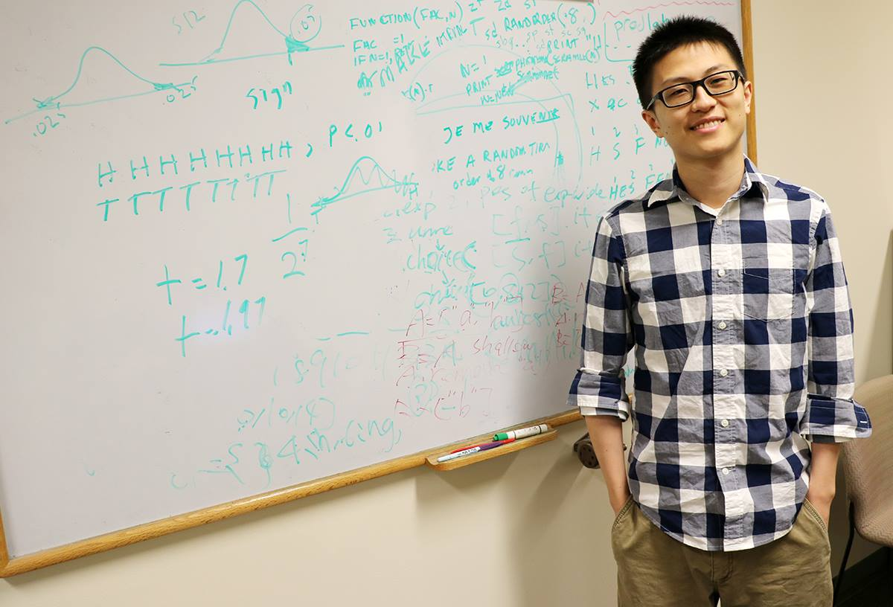

 
My name is Yuan Bian (Chinese: 边缘; Pronunciation: Yoo-an Bee-an). I am a senior Psychology major in University of Illinois at Urbana-Champaign. I am originally from Hangzhou, China.

My research interests are majorly in computational psycholinguistics (cognitive models!). I am currently working with two groups: at UIUC, I work in Dr. Gary Dell's Langauge Production Lab on adult phonotactics learning of 2nd order constraints with suprasegmental contexts; at Stanford, I work with Dr. Abdellah Fourtassi and Dr. Michael Frank (PI) on predicting age of acquisition using word connectivity.

In my leisure time, I am fascinated with philosophy of mind and metaphysics and often read Stanford Encyclopedia of Philosophy. I like learning about languages (but, I am not able to speak any other language except Chinese and English; I am mostly interested in the linguistic aspect of a language).

I like Icelandic and Celtic music.

